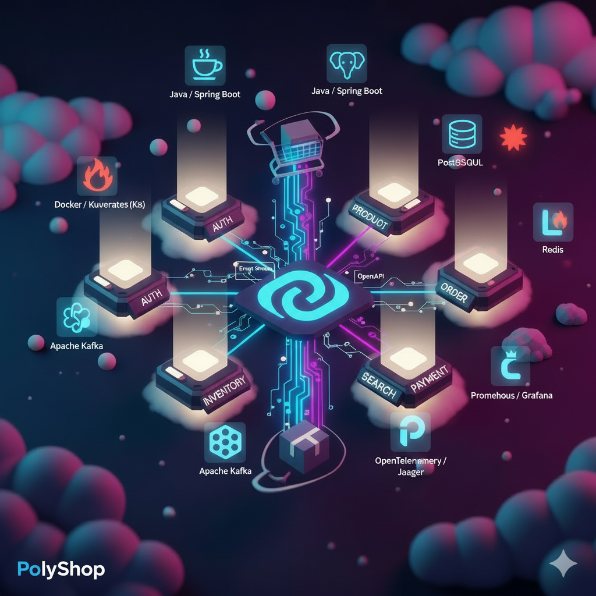

# PolyShop – Microservices E-Commerce Platform

PolyShop is a fully modular, production-ready microservices e-commerce system designed for scalability, observability, testability, and clean domain separation.
It includes authentication, products, orders, inventory management, payments, notifications, analytics, and a public gateway API aggregator.

---

# 1. Architecture Overview

```
PolyShop/
│
├── auth-service/           # Authentication, sessions, JWT issuance
├── product-service/        # Catalog, categories, variants
├── inventory-service/      # Stock, reservations, movements
├── order-service/          # Order lifecycle, state machine
├── payment-service/        # Payments, refunds, webhooks
├── notification-service/   # Email/SMS templates & dispatch
├── analytics-service/      # Sales metrics, reporting
│
├── api-gateway/            # Public API surface (OpenAPI refs)
│
├── common-libs/
│   ├── common-java/        # Shared Java utilities
│   ├── api-schemas/        # Shared OpenAPI definitions
│   └── ts-sdk/             # TypeScript client SDK
│
├── qa/                     # Testing suite (Postman, Newman, k6, Pact)
└── docs/                   # Architecture, runbooks, ADRs, diagrams
```

Every service is independently deployable. Shared behavior is abstracted inside `common-libs` to ensure consistency.

---

# 2. Technology Stack

### Backend (per service)

* **Java 21**, Spring Boot 3.5.x
* Hibernate / JPA
* PostgreSQL / MySQL
* Kafka events for async flows
* Redis (sessions / rate limit / idempotency)

### API Layer

* **OpenAPI 3.1**
* Complete schemas under `/common-libs/api-schemas`
* TypeScript SDK auto-generated

### Testing & QA

* Postman collections
* Newman CI runner (CLI)
* k6 performance scripts
* Pact contract testing

### DevOps

* Docker & docker-compose
* GitHub Actions CI/CD
* Service health endpoints
* Structured logging with MDC (`X-Request-Id`)

---

# 3. Running Locally

## Requirements

* JDK 21
* Docker & Docker Compose
* Node.js 18+
* PostgreSQL (or run via compose)

## Start all services

```
docker compose up --build
```

## Start one service (example: auth)

```
cd auth-service
./gradlew bootRun
```

## API Documentation

Every service exposes:

```
/swagger-ui.html
/openapi
```

Gateway OpenAPI is under:
`/api-gateway/openapi.yaml`

---

# 4. Shared Libraries

## 4.1 common-java

Shared utility modules:

* `GlobalErrorHandler`
* `ServiceException`
* `ErrorResponse`
* `RequestIdFilter`
* `PageResponse`
* `JwtUser`
* `DateTimeUtils`
* `IdempotencyKeyGenerator`

Imported via:

```
implementation(project(":common-libs:common-java"))
```

## 4.2 api-schemas

Shared OpenAPI definitions reusable across:

* Product
* Order
* Inventory
* Payment
* Auth
* Notification
* Analytics

Referenced using:

```
$ref: './common.yaml#/components/schemas/ErrorResponse'
```

## 4.3 TypeScript SDK

Located at:

```
common-libs/ts-sdk/
```

Exports:

* DTOs
* Events
* HTTP helpers
* ID utilities

Installable via npm if published.

---

# 5. Testing (QA Suite)

All QA assets in `/qa`:

```
qa/
├── postman/               # Postman collections + environments
├── newman/                # CI runner + reports
├── pact-tests/            # Producer/consumer contract tests
├── performance-tests/     # k6 load testing
└── README.md
```

### Run all Newman tests

```
./qa/newman/run-tests.sh
```

### Run k6 load tests

```
k6 run qa/performance-tests/load-test.js
```

### Run Pact tests

```
npm test
```

---

# 6. CI/CD

GitHub Actions pipelines include:

* Lint + format checks
* Build + test per module
* Run Newman regression suite
* Run Pact contract verification
* Build Docker images
* Push to registry
* Deploy to environment

Configuration under:

```
.github/workflows/
```

---

# 7. Logging & Observability

### Request Correlation

Every service includes:

```
X-Request-Id
```

Attached via:

* `RequestIdFilter`
* MDC injection
* Propagated across microservices

### Health Checks

All services expose:

```
/health
/health/ready
/health/live
```

---

# 8. Environment Variables

Each service has:

```
SPRING_PROFILES_ACTIVE=local|dev|prod
DATABASE_URL=
JWT_SECRET=
KAFKA_BOOTSTRAP=
REDIS_URL=
EMAIL_PROVIDER_KEY=
PAYMENT_PROVIDER_SECRET=
```

Check each service's `application.yml` for specifics.

---

# 9. Contribution Guidelines

### Branch naming

```
feature/*
fix/*
docs/*
refactor/*
```

### Code style

* Java: Google Style
* TypeScript: ESLint + Prettier
* YAML linting enabled

### Pull Requests

* Must pass all QA suite tests
* Must update corresponding OpenAPI schemas
* Must include necessary migration scripts

---

# 10. Documentation Structure

```
docs/
├── architecture/
│   ├── microservices.md
│   ├── events-and-sagas.md
│   ├── data-models.md
├── runbooks/
│   ├── auth-service.md
│   ├── order-service.md
│   └── ...
└── adr/
    └── adr-001-service-split.md
```

---

# 11. License

MIT
